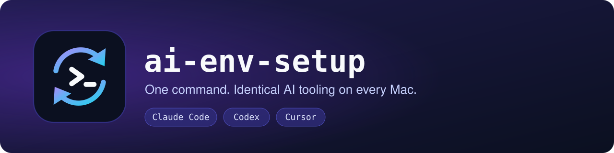

<p align="center">
  
</p>

<p align="center">
  
</p>

# ai-env-setup

Keeps my AI tooling (Claude Code, Codex CLI, Cursor) installed and configured
identically across my Macs. One command sets up a fresh machine, and the same
command brings an existing one back in line. Safe to re-run any time.

- **Declarative** - tools, skill packages, plugins and MCP servers are all
  `manifest/*.yaml` entries. Adding one is a YAML edit, not a code change.
- **Idempotent** - every step only touches what has drifted from its manifest;
  already-synced skills, plugins and MCP servers are skipped.
- **Remembers your picks** - each picker shows the full list with your last
  choices pre-ticked, so after a manifest change you only tick the new entry.
- **One setup, every tool** - the same skills and rules are linked into each
  selected tool's home directory.

## Contents

- [Install](#install) - [Usage](#usage) - [What it writes to your machine](#what-it-writes-to-your-machine) - [Uninstall](#uninstall)
- [How syncing works](#how-syncing-works)
- [Customizing](#customizing): [AI tool](#adding-an-ai-tool), [skill](#adding-a-skill), [rule](#adding-a-universal-rule), [skill package](#adding-an-external-skill-package), [plugin](#adding-a-plugin), [MCP server](#adding-an-mcp-server)
- [Per-project GitHub board rules](#adding-board-specific-github-issue-rules-to-a-project) - [Layout](#layout)

Requires macOS and `git`. Everything else (Homebrew, `yq`, `gum`) is installed
for you.

## Install

```sh
curl -fsSL https://raw.githubusercontent.com/danielpassos/ai-env-setup/main/install.sh | bash
```

This clones the repo to `~/.ai-env-setup` and runs `bin/setup.sh`, which:

1. installs Homebrew if missing, then `brew bundle` on `Brewfile`
   (this installs `yq` and `gum`, which the steps below depend on)
2. asks which AI tools to configure, via a checkbox prompt - your picks are
   remembered and pre-checked next time
3. for each selected tool: installs its CLI (npm or brew, per
   `manifest/tools.yaml`) and symlinks its declared config/skills into its
   home directory
4. installs the skill packages listed in `manifest/skills.yaml`, via
   `npx skills add`
5. installs the plugins listed in `manifest/plugins.yaml`, via each agent's
   `plugin marketplace add` + install command (Claude Code by default,
   Codex too when a package opts in; only for selected tools)
6. configures the remote MCP servers listed in `manifest/mcp.yaml` for each
   selected tool
7. links itself onto your `PATH` as `ai-env-setup` (`~/.local/bin`)

Prefer to read before you run? Clone it yourself and run `bin/setup.sh`:

```sh
git clone https://github.com/danielpassos/ai-env-setup.git ~/.ai-env-setup
~/.ai-env-setup/bin/setup.sh
```

## Usage

Once installed, just run:

```sh
ai-env-setup
```

It pulls the latest repo state and re-applies everything. Each step only
touches what's drifted from its manifest. In every picker press `x` to toggle
an entry, `ctrl+a` to select all, `enter` to confirm.

| Command / variable | Effect |
| --- | --- |
| `ai-env-setup` | Interactive run: pickers for tools, skills, plugins, MCP servers |
| `ai-env-setup --resync` or `AI_ENV_SETUP_RESYNC=1` | Ignore the sync records and re-sync everything (e.g. after removing something by hand) |
| `AI_ENV_SETUP_TOOLS=codex,cursor` | Skip the tool picker; use these ids from `manifest/tools.yaml` |
| `AI_ENV_SETUP_ALL=1` | Select everything in every picker, no `gum`/TTY needed (`AI_ENV_SETUP_TOOLS` still wins for tools) |
| `ai-env-setup add-github-issue-rules` | Per-project board rules - [see below](#adding-board-specific-github-issue-rules-to-a-project) |
| `ai-env-setup --help` | Full usage |

Anything you untick in the skills, plugins or MCP picker is uninstalled /
removed on that run.

## What it writes to your machine

Nothing is hidden: this is everything `ai-env-setup` creates or changes.

| Where | What | Created by |
| --- | --- | --- |
| `~/.ai-env-setup/` | The git clone of this repo | `install.sh` |
| `~/.local/bin/ai-env-setup` | Symlink to `~/.ai-env-setup/bin/setup.sh` | every run |
| `~/.config/ai-env-setup/selected-{tools,skills,plugins,mcp}` | Your picker choices, one id per line | the pickers |
| `~/.config/ai-env-setup/synced` | Records of what was synced per tool, with a hash of its manifest entry | each successful sync |
| `~/.config/ai-env-setup/synced-seed/` | Temporary migration snapshot; deleted when a run completes | first run after upgrading |
| `~/.claude/skills/*`, `~/.claude/rules/*` | Symlinks into this repo's `skills/` and `rules/` | Claude Code `links` |
| `~/.codex/skills/*` | Symlinks into this repo's `skills/` | Codex `links` |
| `~/.codex/AGENTS.md` | Generated file: every `rules/*.md` concatenated (marked do-not-edit) | Codex `links` |
| `<target>.bak` | A pre-existing file or link that was in the way, moved aside once and never overwritten | any link step |
| Homebrew packages | `yq`, `gum`, plus `claude-code` / `codex` when selected | `brew bundle`, tool install |
| `~/.agents/skills/`, `~/.claude/skills/` | Skill packages installed by the `skills` CLI | `npx skills add` |
| Each tool's own config | Plugins and MCP servers added through `claude`, `codex`, and `~/.cursor/mcp.json` for Cursor | plugin / MCP sync |

The state under `~/.config/ai-env-setup/` is only bookkeeping so re-runs know
what to skip. Deleting it is safe; the next run just re-syncs.

## Uninstall

There is no `ai-env-setup uninstall` command yet, so removal is a short manual
checklist. Do only the parts you want.

**1. Remove skills, plugins and MCP servers** (while it's still installed):
run `ai-env-setup`, untick everything in the skills, plugins and MCP pickers
and confirm. Deselected items are uninstalled from every tool.

**2. Remove the links and state:**

```sh
# links into the tools (only symlinks that point into ~/.ai-env-setup)
find ~/.claude ~/.codex -maxdepth 2 -type l -lname "$HOME/.ai-env-setup/*" -print -delete
rm -f ~/.codex/AGENTS.md          # generated; restore ~/.codex/AGENTS.md.bak if you had one
rm -f ~/.local/bin/ai-env-setup

# bookkeeping and the clone
rm -rf ~/.config/ai-env-setup
rm -rf ~/.ai-env-setup
```

Check for `*.bak` files next to the removed links (`~/.claude/skills/`,
`~/.claude/rules/`, `~/.codex/`) and move any you want back into place.

**3. Optional - remove the tools themselves.** `ai-env-setup` only installs
them, it does not track them as "its own", so only do this if you want them
gone:

```sh
brew uninstall --cask claude-code codex
brew uninstall yq gum             # only if nothing else of yours uses them
```

## How syncing works

After each successful sync of a skill package, plugin, or MCP server for a
given tool (`claude`, `codex`, ...), `ai-env-setup` records a hash of that
manifest entry in `~/.config/ai-env-setup/synced`. A re-run logs
`up to date, skipping` for a pair whose entry is unchanged and only syncs new
entries, edited entries (any change to the entry, description included,
changes the hash), and tools you've newly added. Failed syncs are never
recorded, so they retry next run. Deselecting an item drops its records.
Cheap steps (brew bundle, tool install, link/rule syncing) always run.

To ignore the records and re-sync everything, run `ai-env-setup --resync`.

<details>
<summary>Upgrading from before sync records existed (migration snapshot)</summary>

The first run after upgrading to this behavior has no `synced` file, so it
assumes whatever was in your previous selection is already synced (plugins
only for `claude`, since codex plugins are newer) and records it without
calling any CLI. Entries you hadn't selected before, or that were added to
the manifest since your last run, sync normally. If you had edited an entry
in the manifest between your last real run and that first run, use
`--resync` once.

That assumption is based on a snapshot of your previous selection kept in
`~/.config/ai-env-setup/synced-seed/`. The snapshot is deleted only when a
run completes, so if the first run is cancelled or fails part-way, the next
run reuses the original snapshot (not the picks you made in the cancelled
run) and still skips what was already installed. A completed `--resync`
also finalizes it. A brand-new machine never creates a snapshot.

</details>

## Customizing

Everything below is a `manifest/*.yaml` (or `skills/`, `rules/`) edit - no code
changes.

## Adding an AI tool

Add an entry to `manifest/tools.yaml` - no code changes needed:

```yaml
- id: my-tool
  name: "My Tool"
  home: "~/.my-tool"
  install:
    method: npm          # npm | brew_cask | brew_formula | none
    package: "my-tool-cli"
    version: latest
  links:
    - source: "config/my-tool/AGENTS.md"   # path relative to the repo root
      target: "AGENTS.md"                    # path relative to home
    - source: "skills"                        # the shared skills library
      target: "skills"
      expand: true                              # symlink each child individually, not the whole dir
```

`source` is always relative to the repo root, so it can point at a
tool-specific file under `config/<id>/`, or at a shared root path like
`skills/` that more than one tool links in. `install: null` and `links: []`
are valid - useful for a stub entry you haven't fully wired up yet (see
`cursor` in the current manifest).

## Adding a skill

Create `skills/<name>/SKILL.md`, then add it to whichever tool's `links` list
should pick it up (via the `skills` -> `skills`, `expand: true` entry - see
`manifest/tools.yaml` for tools that already have one). Any tool that later
gains its own skills concept can link the same `skills/` directory in.

## Adding a universal rule

`rules/<topic>.md` holds a behavioral rule that's genuinely universal - true
for every project, not tied to one project's IDs or conventions, and worded
without any one tool's specific syntax (no literal tool-call snippets, no
"the Edit tool" style references). Each file is one topic.

Link it into whichever tools should receive it, in `manifest/tools.yaml`:

- A tool with a directory-of-topics instructions mechanism (like Claude
  Code's `~/.claude/rules/`) uses `expand: true`, same as `skills/` - each
  file becomes its own symlink.
- A tool with a single global instructions file (like Codex CLI's
  `~/.codex/AGENTS.md`) uses `concat: true` - every file under `rules/` is
  concatenated into one generated file, marked at the top as
  generated-do-not-edit. Hand-editing that generated file gets it backed up
  to `<target>.bak` on the next run rather than silently overwritten.

Project-specific content (fixed IDs, a project's own commit-scope list,
etc.) does **not** belong in `rules/` - keep that in the project's own
`AGENTS.md`/`CLAUDE.md` instead.

## Adding an external skill package

Someone else's published skill package (e.g. `vercel-labs/agent-skills`) is
different from a skill you author yourself - add it to
`manifest/skills.yaml` instead of the `skills/` directory:

```yaml
packages:
  - source: "vercel-labs/agent-skills"
    # skills: ["vercel-optimize"]  # optional - install only these skill(s)
    # only: ["claude"]              # optional - install only for these tools (this repo's ids)
```

This runs `npx skills add <source> --global --yes [--skill ...] [--agent ...]`
for every entry on each `ai-env-setup` run - see https://skills.sh. `only`
takes this repo's own tool ids from `manifest/tools.yaml` and translates them
to the `skills` CLI's agent ids under the hood (e.g. `claude` -> `claude-code`,
via each tool's `skills_agent` field) - use it unless you need to target an
agent this repo doesn't otherwise manage, in which case `agents` takes the
CLI's own agent ids directly (pass a bogus `--agent` value to
`npx skills add --help` to see the full accepted list).

## Adding a plugin

Some packages are only ever published as a plugin marketplace, with no
generic `skills add` equivalent - add those to `manifest/plugins.yaml`
instead. Plugins install through each agent's own CLI rather than the
`skills` CLI, so scope is the `agents` field (`claude` and/or `codex`)
rather than `only`. Always set it explicitly on every entry (the sync falls
back to `["claude"]` if omitted, but don't rely on that):

```yaml
packages:
  - agents: ["claude", "codex"]
    marketplace_source: "latent-spaces/brag"
    marketplace: "brag"               # from the repo's .claude-plugin/marketplace.json
    plugin: "brag"                    # from that file's plugins[].name
```

For each agent in `agents` that is also among the tools selected this run
(and whose CLI is installed), this runs `claude plugin marketplace add
<marketplace_source>` then `claude plugin install <plugin>@<marketplace>
-y`, or `codex plugin marketplace add <marketplace_source>` then `codex
plugin add <plugin>@<marketplace>`. All of these are idempotent, so
re-running is a no-op success; a failure for one agent doesn't skip the
other. Only list `codex` for a plugin that ships a Codex manifest.
`marketplace` isn't guessed from `marketplace_source`; read it from the
target repo's own `.claude-plugin/marketplace.json` since it doesn't have to
match the repo name. Deselecting a plugin in the picker tries to uninstall
it from every agent whose CLI is present.

## Adding an MCP server

Add a remote (hosted HTTP) MCP server to `manifest/mcp.yaml`:

```yaml
servers:
  - id: notion
    url: "https://mcp.notion.com/mcp"
    # only: ["claude"]  # optional - only configure for these tools (this repo's ids)
```

Only hosted HTTP endpoints are supported - there's no schema here for a
local/stdio server. `only` works like `manifest/skills.yaml`'s: omit it and
the server is configured for whichever tools you selected this run instead
of every tool.

Each selected tool gets the entry written a different way:

- **Claude Code**: `claude mcp add --transport http --scope user <id> <url>`
- **Codex CLI**: `codex mcp add <id> --url <url>`
- **Cursor**: no MCP CLI exists, so `bin/lib/mcp.sh` writes
  `.mcpServers.<id>.url` into `~/.cursor/mcp.json` directly via `yq`

A tool id with no case in `bin/lib/mcp.sh`'s dispatch (i.e. not one of the
three above) is skipped with a warning rather than failing the run.

If the server requires OAuth (as both `notion` and `atlassian` do), this
only writes the config entry - it can't complete the login for you. Claude
Code and Cursor prompt for it on first use inside the tool; Codex CLI needs
one manual `codex mcp login <id>` after the entry exists.

## Adding board-specific GitHub issue rules to a project

`ai-env-setup add-github-issue-rules` is different from the rest of this
tool: it's scoped to a single target project, not this machine. Run it from
inside that project's own repo:

```sh
ai-env-setup add-github-issue-rules
```

It resolves the repo's GitHub owner via `gh repo view`, lists that owner's
GitHub Projects (v2) boards and asks which one this repo uses, fetches that
board's real Status/Priority/Size field and option IDs via `gh project
field-list`, and writes/refreshes a marked block in that project's own
`AGENTS.md` - never in this repo. Re-running it re-fetches live and
replaces only that marked block, so board changes (a renamed column, a new
priority option) never go stale. Pass `--owner <login>` and/or `--project
<number>` to skip the auto-detection/picker, e.g. for scripting.

Since Claude Code reads `CLAUDE.md`, not `AGENTS.md`, it also creates a
`CLAUDE.md` with an `@AGENTS.md` import if the target project doesn't have
one yet - otherwise the rules it just wrote would be invisible to Claude
Code. An existing `CLAUDE.md` is never overwritten; if it doesn't already
import `AGENTS.md`, you'll get a warning instead so you can add the import
yourself.

Requires `gh` to be installed and authenticated with the `project` token
scope (`gh auth refresh -s project` if it's missing).

The generated text's wording lives entirely in `bin/lib/templates/*.md`
(`github-issue-rules.md` for the overall skeleton, `field-id-line.md` for
each Status/Priority/Size bullet, `two-step-pattern.md` for the `gh`
command example) - edit those files to reword output, not
`bin/lib/github_rules.sh`. The script only fetches values live from `gh`,
decides which optional templates apply to this board, and fills in each
template's `{{PLACEHOLDER}}` tokens.

The formatting/writing-style rules that don't depend on a board at all
(heredoc escaping, no hard-wrapping issue bodies, the issue body shape) are
not part of this - they're already universal, and live in
`rules/github-issue-style.md` like every other file in `rules/`.

## Layout

```
Brewfile                    # ai-env-setup's own deps: yq, gum (not the AI tools themselves)
manifest/
  tools.yaml                 # the registry: every AI tool ai-env-setup knows about
  skills.yaml                 # skill packages pulled in via `npx skills add`
  plugins.yaml                 # Claude Code / Codex plugins pulled in via each CLI's `plugin` command
  mcp.yaml                     # remote MCP servers configured per-tool
skills/<name>/               # my own skills, shared - any tool's manifest entry can link them in
rules/<topic>.md              # universal, tool-agnostic rules shared across every project - see "Adding a universal rule"
config/<id>/                 # per-tool config not covered by skills/ or rules/ (currently unused - no tool needs one)
bin/
  setup.sh                     # main entrypoint
  lib/
    common.sh                   # logging, symlink+backup helper, path expansion
    brew.sh                      # bootstraps Homebrew, applies Brewfile
    tools.sh                     # reads manifest/tools.yaml, drives the tool selector
    install.sh                    # installs a selected tool's CLI (npm / brew_cask / brew_formula)
    links.sh                      # symlinks a selected tool's declared links into its home dir
    skills.sh                      # installs manifest/skills.yaml via `npx skills add`
    plugins.sh                      # installs manifest/plugins.yaml via `claude`/`codex plugin`
    mcp.sh                           # configures manifest/mcp.yaml per-tool
install.sh                    # curl-pipeable bootstrap (clone + hand off to setup.sh)
```
